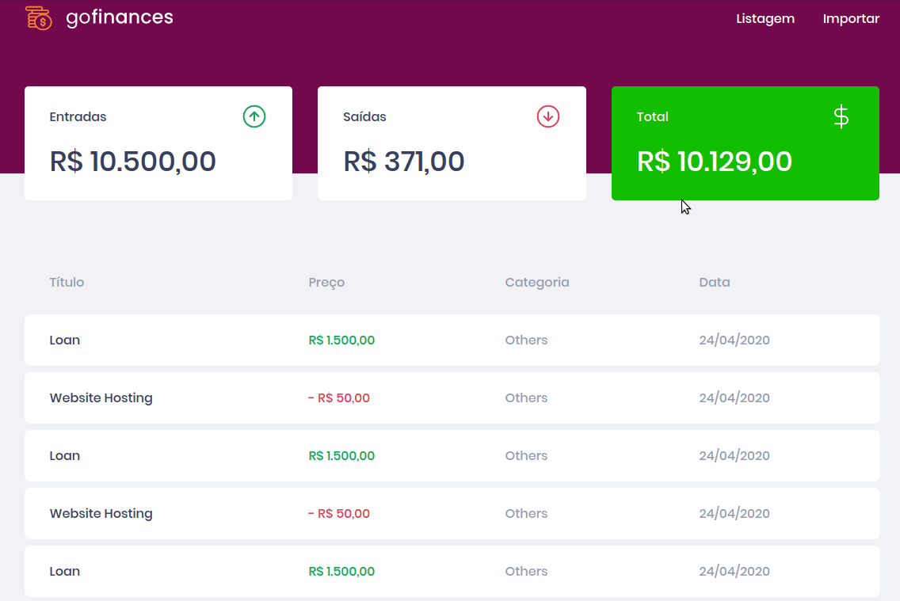

# Desafio 07: GoFinances Web

> Projeto Aplicado pela rocketseat durante o bootcamp :rocket: Gostack 11 .


## Sobre o Desafio

Nesse desafio, foi necessário continuar desenvolvendo a aplicação de gestão de transações **GoFinance** mas agora a parte web foi desenvolvida, [:rocket: **veja o desafio 06 com a API do projeto** :rocket:](https://github.com/tnazevedo/Desafio06-BancoDeDadosDeArquivosNodeJs).<br/><br/>
Treinando o que foi aprendido até agora com **React** junto ao **TypeScript**, utilizando rotas e envio de arquivos por formulário!

## :exclamation: Dependências do projeto

> :thumbsup: Dependencias de Desenvolvimento.

```json
"devDependencies": {
    "@testing-library/jest-dom": "^4.2.4",
    "@testing-library/react": "^9.3.2",
    "@testing-library/user-event": "^7.1.2",
    "@types/axios": "^0.14.0",
    "@types/jest": "^24.0.0",
    "@types/node": "^12.0.0",
    "@types/react": "^16.9.0",
    "@types/react-dom": "^16.9.0",
    "@types/react-router-dom": "^5.1.4",
    "@types/styled-components": "^5.1.0",
    "@typescript-eslint/eslint-plugin": "^2.28.0",
    "@typescript-eslint/parser": "^2.28.0",
    "axios-mock-adapter": "^1.18.1",
    "eslint": "^6.8.0",
    "eslint-config-airbnb": "^18.1.0",
    "eslint-config-prettier": "^6.10.1",
    "eslint-import-resolver-typescript": "^2.0.0",
    "eslint-plugin-import": "^2.20.1",
    "eslint-plugin-jsx-a11y": "^6.2.3",
    "eslint-plugin-prettier": "^3.1.3",
    "eslint-plugin-react": "^7.19.0",
    "eslint-plugin-react-hooks": "^2.5.0",
    "prettier": "^2.0.4",
    "react-app-rewired": "^2.1.5",
    "ts-jest": "^25.4.0"
  }

```

> :thumbsup: Dependencias de produção.

```json
"dependencies": {
   "axios": "^0.19.2",
   "date-fns": "^2.12.0",
   "filesize": "^6.1.0",
   "history": "^4.10.1",
   "polished": "^3.5.2",
   "react": "^16.13.1",
   "react-dom": "^16.13.1",
   "react-dropzone": "^10.2.2",
   "react-router-dom": "^5.1.2",
   "react-scripts": "3.4.1",
   "styled-components": "^5.1.0",
   "typescript": "~3.7.2"
 },

```

## :ok_hand: Funcionalidades da aplicação

- **Listar as transações da sua API**: `Dashboard` deve ser capaz de exibir uma listagem através de uma tabela, com o campo `title`, `value`, `type`, `category`.


- **Exibir o balance da sua API**: A página `Dashboard`, deve exibir o balance que é retornado do backend, contendo o `total geral`, junto ao total de `entradas`(income) e `saídas` (outcome).


- **Importar arquivos CSV**:A página `Import`, você deve permitir o envio de um arquivo no formato `csv` para o backend, que irá fazer a importação das transações para o seu banco de dados.
  

## Configuração para Desenvolvimento

- Basta utilizar o gerenciador de pacotes para instalar todas as dependências do projeto que já estão no arquivo `package.json`.

:bangbang: Não esqueça de fazer o download da api [clique para acessar API](https://github.com/tnazevedo/Desafio06-BancoDeDadosDeArquivosNodeJs).

```sh
yarn || npm
```

## :v: :v: Meta

:v: Talita Azevedo :v: – [Github - tnazevedo](https://github.com/tnazevedo/) – talita.azevedo360@gmail.com

## :star: :star: :star: Como Contribuir

1. Faça o _fork_ do projeto [`Clique aqui`:v:](https://github.com/tnazevedo/Desafio07-GoFinancesWeb/fork)
2. Crie uma _branch_ para sua modificação (`git checkout -b feature/fooBar`)
3. Faça o _commit_ (`git commit -am 'Add some fooBar'`)
4. _Push_ (`git push origin feature/fooBar`)
5. Crie um novo _Pull Request_.
